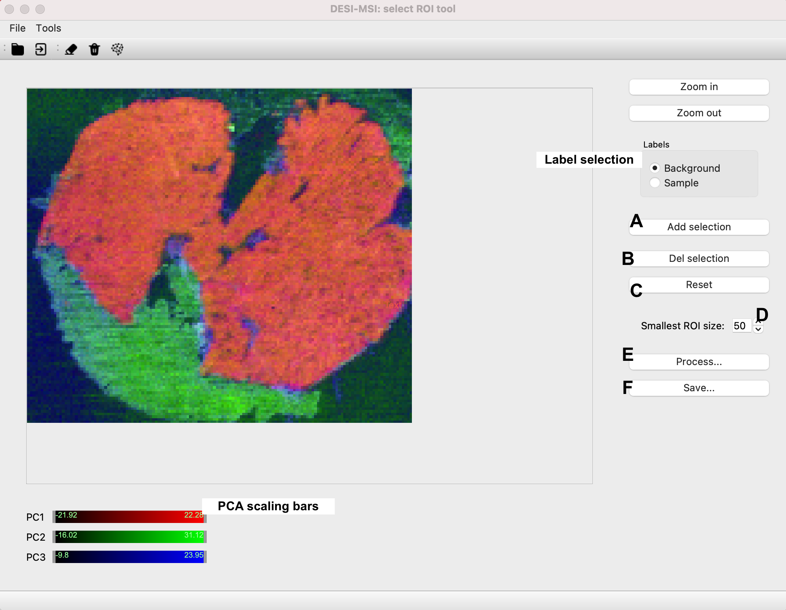
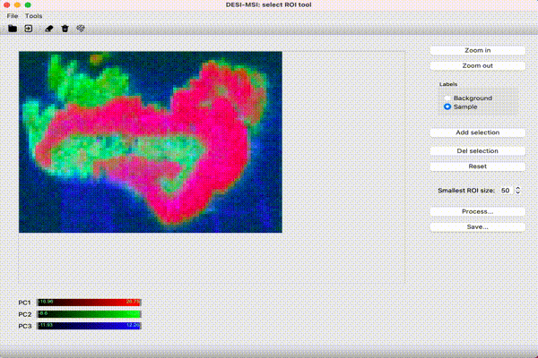
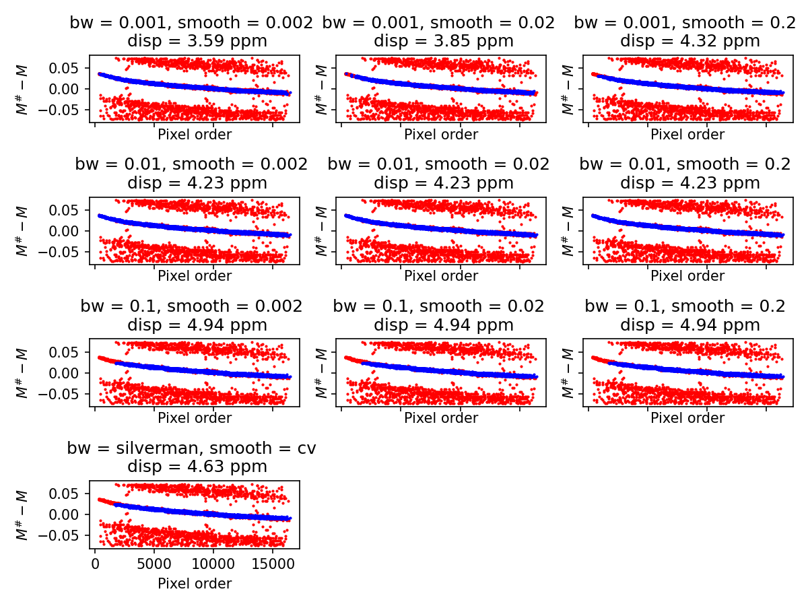

# DESI-MSI mass recalibration

Companion code for the publication:

Inglese, P., Huang, H., Wu, V., Lewis, M.R. and Takats, Z., 2021. Mass
recalibration for desorption electrospray ionization mass spectrometry imaging
using endogenous reference ions. _bioRxiv_.

https://www.biorxiv.org/content/10.1101/2021.03.29.437482v2

**NOTE**: this code is related to the latest version of the preprint.

### Required packages (tested on Python 3.8-3.9)

```
pandas==1.2.0
scikit-learn==0.24.0
pyimzml==1.4.1
tqdm==4.55.1
joblib==1.1.0
matplotlib==3.3.3
pygam==0.8.0
statsmodels==0.13.1
kdepy==1.1.0
scipy==1.6.0
scikit-image==0.18.1
numpy==1.21.4
pillow==8.4.0
pyqt==5.12.3
opencv==4.5.0
```

## How to run:

## ROI selection

```
python select_roi.py
```



The _centroided_ imzML file is loaded using the `File -> Open raw peaks ...`
button (shortcut = `CTRL + O`). Once the reference image is displayed, the user
can start annotating with the selected label (top right checkbox), by drawing a
closed contour using the mouse.  
In case of mistakes during the drawing, the user can delete the current curve by
pressing the `Delete selection` button (B).  
Once the region is drawn, the user can confirm by pressing the `Add selection`
button (A). The image is updated showing the currently annotated pixels.  
When enough pixels are annotated with both labels, the image can be segmented
pressing the `Process...` button (E).  
The current segmentation mask is saved in a CSV file in the same folder of the
`imzML` file by pressing the `Save...` button (F). All connected regions smaller
than the selected value in `Smallest ROI size:` (D) are assigned to the
background.  
The current annotations or segmentation can be reset by pressing the `Reset`
button (C).  
The RGB colors of the image can be controlled through the sliders below the
image.



## Mass recalibration

```
usage: desi_recalibration.py [-h] 
                             [--db database]
                             --analyzer {tof,orbitrap} 
                             --ion-mode {pos,neg}
                             [--search-tol SEARCH_TOL]
                             [--kde-bw KDE_BW]
                             [--degree DEGREE]
                             [--max-res-smooth SMOOTH]
                             [--max-dispersion MAX_DISP]
                             [--min-coverage MIN_COVERAGE]
                             [--plot-ref-imgs]
                             [--parallel]
                             input output roi

DESI-MSI recalibration tool

positional arguments:
  input                 Input imzML file (centroided).
  output                Output imzML file.
  roi                   Sample ROI mask CSV file. If set equal to 'full', 
                        the entire image is analyzed.

optional arguments:
  -h, --help            show this help message and exit
  --db DB               Path of the reference masses database. If equal to 
                        'builtin' a combination of public databases
                        will be used (default='builtin')
  --analyzer {tof,orbitrap}
                        MS analyzer.
  --ion-mode {pos,neg}  ES Polarization mode.
  --search-tol SEARCH_TOL
                        Search tolerance expressed in ppm. If 'auto', default 
                        value for MS analyzer is used.
  --kde-bw KDE_BW       KDE bandwidth. It can be numeric, 'silverman' or 
                        'silverman_robust' (default='silverman').
  --degree DEGREE       Degree of regression model for pixel masses 
                        recalibration. If 'auto', 1 is used for Orbitrap,
                        5 is used for Tof (default=auto).
  --max-res-smooth SMOOTH
                        Smoothing parameter for spline. It represents the 
                        maximum sum of squared errors. If set to
                        'cv', it is determined by cross-validation 
                        (default = 'cv').
  --max-dispersion MAX_DISP
                        Max dispersion in ppm for outlier detection 
                        (default=10.0).
  --min-coverage MIN_COVERAGE
                        Min. coverage percentage for hits filtering 
                        (default=75.0).
  --plot-ref-imgs       Save the intensity images of the reference masses. 
                        It can slow down the process (default=False).
  --parallel            Use multithreading.
                   
```

The code saves the images of the candidate reference ions in the subfolder of
the output folder, called `runID + '_recal_imgs'`, where `runID` is the name of
the input imzML file.

## Testing KDE bandwidth and Spline smoothing

By defaults, KDE bandwidth is set to rule-of-thumb value "silverman", and spline
smoothing parameter is determined by cross-validation.  
In some cases, the user may be interested in using a custom value for those
parameters.  
The script `check_kde_bw.py` tests various values and plots the results in a
subfolder of the input imzML folder.  
Various values are tested on the 3 ions with the smallest median absolute error
from the nominal mass, that are detected in more than `MIN_COVERAGE` ROI pixels.
The script saves the scatter plots of the outliers and inliers matched masses in
the subfolder `_calib` of the input folder.

```
usage: check_kde_bw.py [-h] [--analyzer {tof,orbitrap}] --ion-mode {pos,neg} 
                      [--search-tol SEARCH_TOL]
                      [--min-coverage MIN_COVERAGE]
                      input roi

DESI-MSI recalibration. Test time series parameters

positional arguments:
  input                 Input imzML file.
  roi                   Sample ROI mask CSV file. If set equal to 'full',
                        the entire image is analyzed.

optional arguments:
  -h, --help            show this help message and exit
  --analyzer {tof,orbitrap}
                        MS analyzer.
  --ion-mode {pos,neg}  ES Polarization mode.
  --search-tol SEARCH_TOL
                        Search tolerance expressed in ppm. If 'auto', default 
                        value for MS analyzer is used.
  --min-coverage MIN_COVERAGE
                        Min. coverage percentage for hits filtering 
                        (default=75.0).
```

Example:



The outliers are plotted in red and the inliers (used to fit the GAM) are
plotted in blue. The dispersion is reported in the title (`disp`).  
In this case, a value of `bw=0.01` is optimal since inliers are detected in the
initial pixels (low value of `pixel order`). For the `smooth` parameter, no
difference is observed, so it is suggested to keep it equal to `'cv'`.
